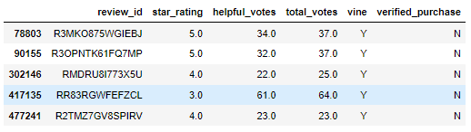
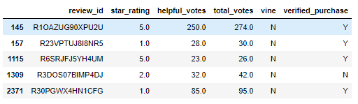
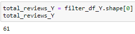
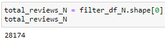
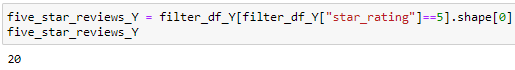
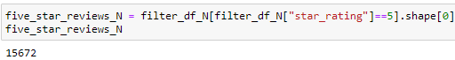
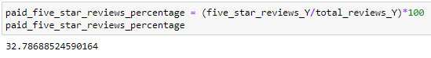
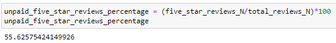

# Amazon_Vine_Analysis

## OVERVIEW

For this project, we selected a dataset from the options available in [Amazon Review datasets](https://s3.amazonaws.com/amazon-reviews-pds/tsv/index.txt). Specifically, we chose the data on Grocery items, which can be found [here](https://s3.amazonaws.com/amazon-reviews-pds/tsv/amazon_reviews_us_Grocery_v1_00.tsv.gz).

The focus of this project is to examine the Amazon Vine program and determine if there is a tendency for Vine members to provide more positive reviews. To conduct the analysis, PySpark was utilized to extract the dataset, transform the data, and load the transformed information into an AWS RDS instance through pgAdmin. Various metrics were then calculated.

## Technologies 
- PostgresSQL
- pgAdmin 4
- AWS
- Google Colab
- Python

## RESULTS

We expored our table vine_table from pgAdmin as a csv file and read it using Pandas, the resulting Dataframe was then filtered where `total_votes` were greater or equal to 20 and `helpful_votes` divided by `total_votes` was greater than 50%. Then we split the Dataframe into two Dataframes, one for paid reviews and another for unpaid reviews.

Paid Reviews dataframe           |  Unpaid Reviews dataframe
:-------------------------:|:-------------------------:
  |  

### Total reviews

there were a total of 61 vine reviews and 28174 non-Vine reviews

Vine Reviews           |  non-Vine Reviews
:-------------------------:|:-------------------------:
  |  

### 5-star reviews

there were a total of 20 5-star Vine reviews and 15672 5-star non-Vine reviews.

5-star Vine Reviews           | 5-star non-Vine Reviews
:-------------------------:|:-------------------------:
  |  

### 5-star reviews percentages

32.8% of Vine reviews were 5-star reviews and 55.6 of non-Vine reviews were 5-star reviews

5-star Vine Reviews percentage          | 5-star non-Vine Reviews percentage
:-------------------------:|:-------------------------:
  |  

## SUMMARY

According to the findings, there does not appear to be a bias towards positive ratings from Vine members. In fact, the percentage of 5-star ratings from Vine members was about 23% lower than that of non-Vine members (32.8% vs. 55.6%). This suggests that Vine customers may be more critical when submitting their reviews. To further support this statement, while the sample size of 61 Vine reviews and 28,174 non-Vine reviews is sufficient for drawing some conclusions, it may be beneficial to gather additional data in order to increase the reliability and validity of the results.
An additional analysis to support this statement could be analyzing the language and tone used in the reviews. If the reviews from Vine members do not consistently use more positive language or have a more positive tone than those from non-Vine members, this could also suggest that there is no bias towards positive reviews.